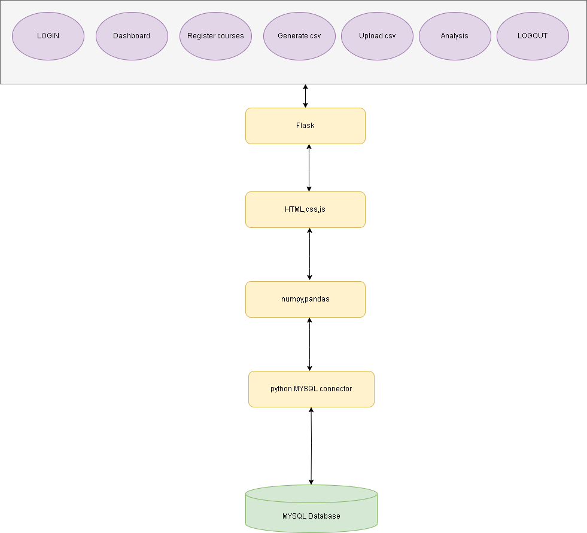

# Ed-Eu-Helper
A flask based app for education support
## Overview

Over the years E-Books, Online exams, and various other new methods have come in aiding the teaching-learning process. In the recent past, the education process has been oscillating between online and offline modes, and remains turbulent. Some aspects of the Outcome Based Education use paper based methodologies to assess student attainments. The proposed work aims to provide a simple yet effective and easy-to-use solution for the entities involved in the process to integrate all related data, enhance teaching-learning process through the plethora of analysis included in the work.

## Table of Contents

- [Tech](#tech) 
- [Data](#data) 

## Tech

**Front-End**

- [BootstrapV5](https://getbootstrap.com/)
- [HTML5](https://en.wikipedia.org/wiki/HTML5)
- [CSS3](https://www.w3schools.com/css/)
- [JS](https://www.chartjs.org/)

**Back-End**

- [Python3](https://www.python.org/download/releases/3.0/)

**Database**

- [MySQLDB](https://mysqlclient.readthedocs.io/user_guide.html)
- [Flask](https://flask.palletsprojects.com/en/2.2.x/)
- [Pandas](https://pandas.pydata.org/docs/index.html)

